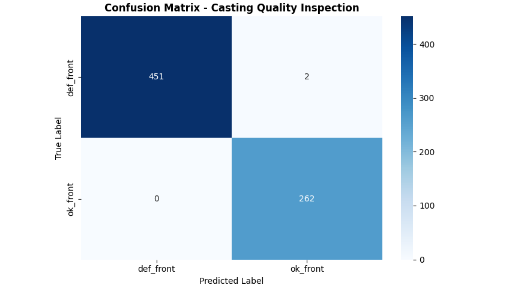
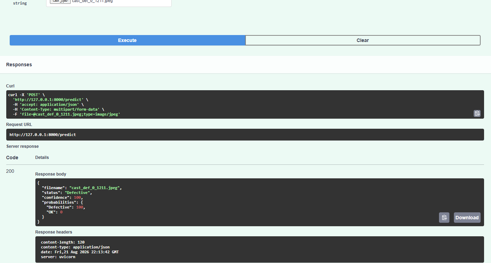
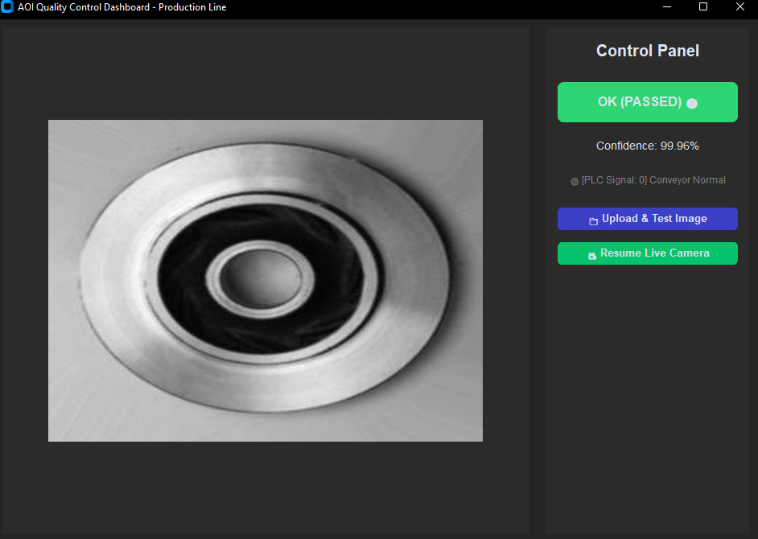
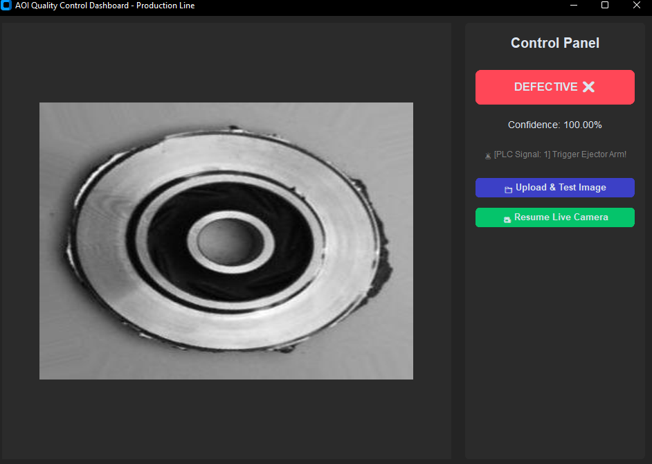

# 🏭 CastVigil: Edge-AI Automated Optical Inspection (AOI) for Industrial Quality Control


[](https://tensorflow.org)
[](https://fastapi.tiangolo.com)
[](https://onnxruntime.ai)
[](https://customtkinter.tuxfamily.org)
[](LICENSE)


An end-to-end, high-performance Automated Optical Inspection (AOI) system designed for real-time defect detection in metal casting manufacturing lines. Operating completely at the edge with zero latency, **CastVigil** bridges the gap between deep learning research and robust industrial automation.

---

## 📌 Problem Statement & Industrial Context

In modern metal casting foundries, manufacturing components often suffer from structural and surface defects (such as blowholes, cracks, and shrinkage cavities) due to thermal stress and material impurities. 

### The Challenges:
* **Human Error & Fatigue:** Manual visual inspection by factory workers is highly subjective, error-prone, and unsustainable during high-speed, continuous mass production.
* **Severe Financial Costs:** Failing to detect a defective casting early leads to catastrophic assembly failures downstream, high product return rates, and damaged brand reputation.
* **The "False Negative" Catastrophe:** Passing a bad part as good (False Negative) is the most expensive mistake in a factory. Conversely, rejecting good parts needlessly (False Positives) causes unnecessary material waste.

### The Solution:
**CastVigil** automates this entire pipeline. By deploying a heavily optimized, lightweight Deep Learning model directly onto the factory floor (Edge deployment), it delivers rapid, consistent, and highly precise non-destructive testing (NDT).

---

## 🗺️ Project Architecture & Roadmap

The system is strategically architected into three distinct phases to ensure a production-ready software lifecycle:

* **Phase 1: Training & Model Optimization:** Utilizing Transfer Learning on the *Casting Product Image Data* dataset using an integrated data augmentation pipeline. The final model is compiled and exported into the high-performance universal **ONNX format**.
* **Phase 2: Verification Microservice (FastAPI):** A lightweight backend web API developed to host the ONNX engine, enabling remote engineering teams to programmatically validate individual product images with structured JSON payloads.
* **Phase 3: Edge-Native Production Dashboard:** A localized industrial Graphical User Interface (GUI) that captures real-time video frames from conveyor belt cameras, performs ultra-low-latency on-device inference, and simulates automated physical rejection through PLC/hardware-trigger communication signals.

---

## 📈 Model Performance & Statistical Evaluation

Evaluated against an independent, unseen industrial testing partition, the network demonstrated near-perfect statistical reliability. The evaluation focuses heavily on operational safety by minimizing missed defect escapes.

### Key Metrics Summary:
* **Global General Accuracy:** **99.72%** — Out of 715 verification components, 713 were classified flawlessly.
* **Defect Escape Suppression (Recall for Defects):** **99.56%** — Ensures practically all defective units are trapped and contained before exiting the line.
* **Zero-Waste Compliance (Precision for Defective):** **100.00%** — When the model identifies a product as defective, it is absolutely correct, completely eliminating the waste of false alarms on safe parts.

### Comprehensive Analytics Matrix:

| Class Label | Precision | Recall | F1-Score | Support Samples |
| :--- | :---: | :---: | :---: | :---: |
| **Defective (`def_front`)** | 1.0000 | 0.9956 | 0.9978 | 453 |
| **Passed (`ok_front`)** | 0.9924 | 1.0000 | 0.9962 | 262 |
| **Macro Average** | 0.9962 | 0.9978 | 0.9970 | 715 |
| **Weighted Average** | 0.9972 | 0.9972 | 0.9972 | 715 |

### Empirical Verification (Confusion Matrix):
Below is the exact error distribution visualization of the testing phase:

<p align="center">
  
</p>

* **True Positive Localization:** 451 defective parts successfully intercepted. 262 flawless parts safely approved.
* **Critical Escapes:** Only 2 defective components bypassed identification out of the 453 total faulty batch.
* **False Alarms:** **0 (Zero)** operational errors targeting clean parts.

---

## 📂 Project Repository Structure

```text
├── sample_test_images/          # Specialized directory containing sample images for verification testing
│   ├── sample_defective_1.jpg   # Sample casting image showcasing a physical surface defect
│   └── sample_ok_1.jpg          # Sample casting image showing a pristine, approved component
├── train_and_export.py          # Phase 1: Data pipeline optimization, training, and ONNX conversion script
├── casting_model.onnx           # The highly optimized, compiled Edge deployment neural model engine
├── main.py                      # Phase 2: Production-grade FastAPI REST microservice engine
├── dashboard.py                 # Phase 3: GUI Application built via CustomTkinter for local camera streams
├── confusion_matrix.png         # Statistical visualization asset for performance metrics
└── README.md                    # Core project documentation (This file)
```

---

## 📸 System Implementation Gallery

### Phase 2 Deployment: Validation Web API
The scalable web microservice providing instantaneous classification responses via structured API payloads:
<p align="center">
  
</p>

### Phase 3 Deployment: Local Factory Edge Dashboard
The industrial operator cockpit showing automated camera image feeding, real-time diagnostic output, and simulated PLC signal triggers:

#### 🟢 Inspection Mode: Approved Component (OK)
<p align="center">
  
</p>

#### 🔴 Inspection Mode: Defect Interception (Defective)
<p align="center">
  
</p>

---

## 💻 Technical Setup & Execution Guide

### 1. Prerequisites and Package Installations
Deploy the localized environment and required native execution frameworks using python packaging:
```bash
pip install numpy opencv-python pillow onnxruntime fastapi uvicorn customtkinter
```

### 2. Launching the Testing Microservice (FastAPI)
Initiate the remote programmatic inspection server locally:
```bash
uvicorn main:app --reload
```
Navigate your standard browser to `http://127.0.0` to interact with the OpenAPI automated swagger client UI and upload images directly from the `sample_test_images/` folder.

### 3. Executing the Real-Time Factory Floor Display
Boot up the edge operational console connected to your workstation's video acquisition hardware:
```bash
python dashboard.py
```
* Use the **Upload & Test Image** mechanism to feed individual target items from the test images directory, or keep the **Live Camera Stream** enabled for ongoing continuous inspection simulation.

---

## 🚀 Vision & Future Scope
* **Asynchronous Multi-threading:** Isolate the ONNX frame execution loop away from the main UI process to entirely avoid potential visual stuttering during video playback.
* **Hardware Protocol Mapping:** Bind python serial frameworks directly to low-level microcontroller relays (e.g., Arduino or industrial Modbus PLC) to transform code logic outputs into actual hardware physical rejection-arm movements.


## 👨‍💻 Author
**Mohamed Arif Mahyoub Haider**
*Electrical Engineer - Computer and Industrial Control*
